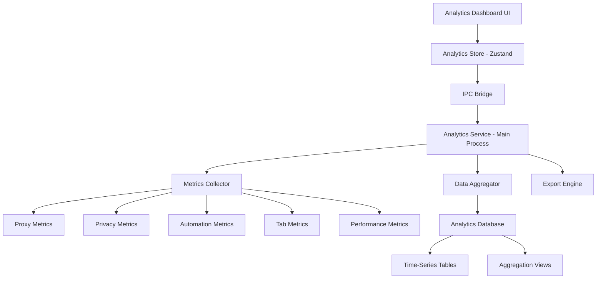
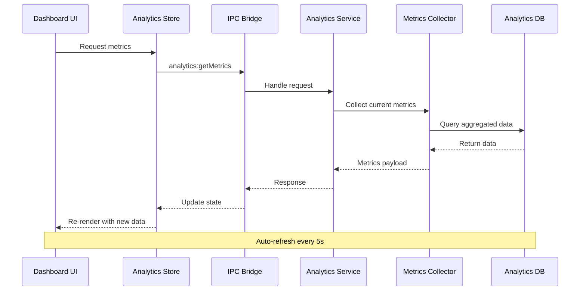

# Epic Brief: Advanced Analytics Dashboard

# Epic Brief: Advanced Analytics Dashboard

**Epic ID**: EP-011  
**Priority**: P0 (User Priority)  
**Timeline**: 2-4 Weeks  
**Status**: Planning  
**PRD Reference**: Section 17 (Success Metrics and KPIs)

---

## 1. Executive Summary

The Advanced Analytics Dashboard is a comprehensive metrics and insights system that provides real-time visibility into all aspects of the Virtual IP Browser's operations. This feature addresses a critical gap in the current implementation where analytics data is collected but not effectively visualized or actionable.

### 1.1 Problem Statement

**Current State**:

- ✅ Metrics collection infrastructure exists (file:electron/core/monitoring/metrics.ts)
- ✅ Database repositories track usage statistics
- ⚠️ **No unified dashboard** to visualize collected data
- ⚠️ **No historical trend analysis** for performance optimization
- ⚠️ **No export capabilities** for reporting
- ⚠️ **Limited actionable insights** from collected metrics

**User Impact**:

- Users cannot see proxy performance trends
- No visibility into privacy protection effectiveness
- Automation success rates are not tracked visually
- Resource usage patterns are hidden
- Cannot generate reports for analysis

### 1.2 Solution Overview

Build a **multi-dimensional analytics dashboard** that provides:

1. **Real-Time Metrics** - Live updates of system performance
2. **Historical Trends** - Time-series analysis with interactive charts
3. **Actionable Insights** - AI-powered recommendations
4. **Export Capabilities** - CSV/JSON/PDF report generation
5. **Performance Monitoring** - Resource usage and optimization alerts
6. **Comparative Analysis** - Before/after comparisons, A/B testing

---

## 2. Goals & Objectives

### 2.1 Primary Goals


| Goal              | Description                                             | Success Metric               |
| ----------------- | ------------------------------------------------------- | ---------------------------- |
| **Visibility**    | Provide complete visibility into all browser operations | 100% metric coverage         |
| **Actionability** | Enable data-driven decision making                      | >80% recommendation adoption |
| **Performance**   | Real-time updates without impacting browser performance | <100ms dashboard refresh     |
| **Usability**     | Intuitive interface for all user personas               | >4.5/5 user satisfaction     |


### 2.2 Key Performance Indicators (KPIs)


| KPI                    | Target                                 | Measurement Method     |
| ---------------------- | -------------------------------------- | ---------------------- |
| Dashboard Load Time    | <2s                                    | Performance monitoring |
| Metric Update Latency  | <500ms                                 | Real-time tracking     |
| Export Generation Time | <5s for 10K records                    | Benchmark tests        |
| User Engagement        | >60% daily active users view dashboard | Analytics tracking     |
| Data Accuracy          | 100% match with source data            | Validation tests       |


---

## 3. Scope & Deliverables

### 3.1 In Scope

#### Module 1: Proxy Analytics

- **Real-time proxy status** (active/failed/checking)
- **Latency trends** over time (line charts)
- **Success rate analysis** per proxy
- **Geographic distribution** (map visualization)
- **Rotation strategy effectiveness** comparison
- **Usage statistics** (requests per proxy)

#### Module 2: Privacy Analytics

- **Tracker blocking statistics** (total blocked, by category)
- **WebRTC leak prevention** effectiveness
- **Fingerprint uniqueness** score
- **Privacy protection score** (composite 0-100)
- **Blocked requests timeline** (area chart)
- **Category breakdown** (pie chart)

#### Module 3: Automation Analytics

- **Task success/failure rates** (gauge charts)
- **Execution timeline** (Gantt chart)
- **Keyword performance** (table with sorting)
- **Search engine comparison** (bar chart)
- **Domain targeting effectiveness** (funnel chart)
- **Resource usage during automation** (multi-line chart)

#### Module 4: Tab Management Analytics

- **Active tab count** over time
- **Memory usage per tab** (stacked area chart)
- **Tab lifecycle metrics** (creation, suspension, closure)
- **Session isolation effectiveness**
- **Tab pool performance** (if implemented)

#### Module 5: Performance Analytics

- **System resource usage** (CPU, Memory, Disk)
- **Database query performance** (avg query time)
- **IPC communication latency**
- **Tab creation time** trends
- **Application launch time** tracking

#### Module 6: Creator Support Analytics

- **Ads viewed per creator** (bar chart)
- **Support session duration** (histogram)
- **Platform distribution** (pie chart)
- **Creator engagement trends** (line chart)

### 3.2 Out of Scope (Future Phases)

- ❌ Predictive analytics / ML models
- ❌ Real-time alerting system (basic alerts only)
- ❌ Multi-user analytics (team features)
- ❌ External data source integration
- ❌ Custom dashboard builder (predefined layouts only)

---

## 4. User Stories & Acceptance Criteria

### User Story AN-001: View Real-Time Dashboard

**As a** user  
**I want to** see real-time metrics on a dashboard  
**So that** I can monitor browser performance at a glance

**Acceptance Criteria**:


| #   | Criteria                                     | Status |
| --- | -------------------------------------------- | ------ |
| 1   | Dashboard loads in <2 seconds                | ☐      |
| 2   | Metrics update every 5 seconds automatically | ☐      |
| 3   | All 6 analytics modules are visible          | ☐      |
| 4   | Charts render smoothly without lag           | ☐      |
| 5   | Data is accurate (matches source)            | ☐      |
| 6   | Responsive design works on all screen sizes  | ☐      |


---

### User Story AN-002: Analyze Historical Trends

**As a** power user  
**I want to** view historical trends with time-range selection  
**So that** I can identify patterns and optimize performance

**Acceptance Criteria**:


| #   | Criteria                                       | Status |
| --- | ---------------------------------------------- | ------ |
| 1   | Time range selector (1h, 24h, 7d, 30d, custom) | ☐      |
| 2   | Charts update when time range changes          | ☐      |
| 3   | Zoom and pan functionality on charts           | ☐      |
| 4   | Tooltip shows exact values on hover            | ☐      |
| 5   | Data aggregation for large time ranges         | ☐      |
| 6   | Historical data persists across restarts       | ☐      |


---

### User Story AN-003: Export Analytics Reports

**As a** SEO professional  
**I want to** export analytics data to CSV/JSON/PDF  
**So that** I can create reports for clients

**Acceptance Criteria**:


| #   | Criteria                                    | Status |
| --- | ------------------------------------------- | ------ |
| 1   | Export button available on each module      | ☐      |
| 2   | CSV export includes all visible data        | ☐      |
| 3   | JSON export preserves data structure        | ☐      |
| 4   | PDF export includes charts as images        | ☐      |
| 5   | Export completes in <5s for 10K records     | ☐      |
| 6   | Filename includes timestamp and module name | ☐      |


---

### User Story AN-004: Receive Performance Insights

**As a** user  
**I want to** receive actionable recommendations  
**So that** I can optimize browser performance

**Acceptance Criteria**:


| #   | Criteria                                                | Status |
| --- | ------------------------------------------------------- | ------ |
| 1   | Insights panel shows top 5 recommendations              | ☐      |
| 2   | Recommendations are context-aware                       | ☐      |
| 3   | Each insight has severity level (info/warning/critical) | ☐      |
| 4   | Click on insight navigates to relevant module           | ☐      |
| 5   | Insights update based on current metrics                | ☐      |
| 6   | User can dismiss or acknowledge insights                | ☐      |


---

## 5. Technical Architecture

### 5.1 System Architecture



### 5.2 Data Flow



### 5.3 Component Structure

```
src/components/dashboard/
├── AnalyticsDashboard.tsx          # Main dashboard container
├── modules/
│   ├── ProxyAnalytics.tsx          # Proxy metrics module
│   ├── PrivacyAnalytics.tsx        # Privacy metrics module
│   ├── AutomationAnalytics.tsx     # Automation metrics module
│   ├── TabAnalytics.tsx            # Tab management metrics
│   ├── PerformanceAnalytics.tsx    # Performance metrics
│   └── CreatorAnalytics.tsx        # Creator support metrics
├── charts/
│   ├── LineChart.tsx               # Time-series line chart
│   ├── BarChart.tsx                # Bar chart component
│   ├── PieChart.tsx                # Pie chart component
│   ├── GaugeChart.tsx              # Gauge/radial chart
│   ├── AreaChart.tsx               # Area chart component
│   └── HeatMap.tsx                 # Heat map component
├── widgets/
│   ├── MetricCard.tsx              # Single metric display
│   ├── TrendIndicator.tsx          # Up/down trend arrow
│   ├── InsightsPanel.tsx           # Recommendations panel
│   └── TimeRangeSelector.tsx       # Time range picker
└── export/
    ├── ExportButton.tsx            # Export trigger
    └── ExportModal.tsx             # Export options modal
```

### 5.4 Database Schema Extensions

**New Tables**:

```sql
-- Analytics snapshots (time-series data)
CREATE TABLE analytics_snapshots (
  id TEXT PRIMARY KEY,
  timestamp DATETIME DEFAULT CURRENT_TIMESTAMP,
  metric_type TEXT NOT NULL, -- 'proxy', 'privacy', 'automation', etc.
  metric_name TEXT NOT NULL,
  metric_value REAL NOT NULL,
  metadata TEXT, -- JSON
  INDEX idx_snapshots_type_time (metric_type, timestamp),
  INDEX idx_snapshots_name_time (metric_name, timestamp)
);

-- Aggregated metrics (hourly/daily rollups)
CREATE TABLE analytics_aggregates (
  id TEXT PRIMARY KEY,
  period_start DATETIME NOT NULL,
  period_end DATETIME NOT NULL,
  granularity TEXT NOT NULL, -- 'hour', 'day', 'week'
  metric_type TEXT NOT NULL,
  metric_name TEXT NOT NULL,
  avg_value REAL,
  min_value REAL,
  max_value REAL,
  sum_value REAL,
  count INTEGER,
  INDEX idx_aggregates_period (period_start, period_end),
  INDEX idx_aggregates_type (metric_type, granularity)
);

-- User insights/recommendations
CREATE TABLE analytics_insights (
  id TEXT PRIMARY KEY,
  created_at DATETIME DEFAULT CURRENT_TIMESTAMP,
  severity TEXT NOT NULL, -- 'info', 'warning', 'critical'
  category TEXT NOT NULL,
  message TEXT NOT NULL,
  action_url TEXT,
  dismissed INTEGER DEFAULT 0,
  acknowledged_at DATETIME
);
```

### 5.5 IPC API Additions

**New Channels**:

```typescript
// Analytics data retrieval
ANALYTICS_GET_METRICS: 'analytics:get-metrics'
ANALYTICS_GET_TRENDS: 'analytics:get-trends'
ANALYTICS_GET_INSIGHTS: 'analytics:get-insights'

// Export functionality
ANALYTICS_EXPORT_CSV: 'analytics:export-csv'
ANALYTICS_EXPORT_JSON: 'analytics:export-json'
ANALYTICS_EXPORT_PDF: 'analytics:export-pdf'

// Real-time updates
ANALYTICS_SUBSCRIBE: 'analytics:subscribe'
ANALYTICS_UNSUBSCRIBE: 'analytics:unsubscribe'
```

**Request/Response Types**:

```typescript
interface GetMetricsRequest {
  modules: AnalyticsModule[]; // ['proxy', 'privacy', ...]
  timeRange?: TimeRange;
}

interface GetMetricsResponse {
  timestamp: Date;
  metrics: {
    [module: string]: ModuleMetrics;
  };
}

interface ExportRequest {
  module: AnalyticsModule;
  format: 'csv' | 'json' | 'pdf';
  timeRange: TimeRange;
  includeCharts?: boolean; // For PDF
}
```

---

## 6. User Interface Design

### 6.1 Dashboard Overview Wireframe

```wireframe
<!DOCTYPE html>
<html>
<head>
<style>
* { margin: 0; padding: 0; box-sizing: border-box; }
body { font-family: system-ui, -apple-system, sans-serif; background: #f5f5f5; padding: 20px; }
.dashboard { max-width: 1400px; margin: 0 auto; }
.header { background: white; padding: 20px; border-radius: 8px; margin-bottom: 20px; box-shadow: 0 1px 3px rgba(0,0,0,0.1); }
.header h1 { font-size: 24px; margin-bottom: 10px; }
.header-controls { display: flex; gap: 10px; align-items: center; }
.time-selector { padding: 8px 12px; border: 1px solid #ddd; border-radius: 4px; background: white; }
.export-btn { padding: 8px 16px; background: #3B82F6; color: white; border: none; border-radius: 4px; cursor: pointer; }
.insights-banner { background: #FEF3C7; border-left: 4px solid #F59E0B; padding: 12px; margin-bottom: 20px; border-radius: 4px; }
.grid { display: grid; grid-template-columns: repeat(3, 1fr); gap: 20px; }
.module { background: white; padding: 20px; border-radius: 8px; box-shadow: 0 1px 3px rgba(0,0,0,0.1); }
.module h2 { font-size: 18px; margin-bottom: 15px; color: #333; }
.metric-row { display: flex; justify-content: space-between; margin-bottom: 10px; }
.metric-label { color: #666; font-size: 14px; }
.metric-value { font-weight: 600; font-size: 16px; }
.chart-placeholder { height: 200px; background: #f9fafb; border: 1px dashed #ddd; display: flex; align-items: center; justify-content: center; color: #999; margin-top: 15px; }
.trend-up { color: #10B981; }
.trend-down { color: #EF4444; }
</style>
</head>
<body>
<div class="dashboard">
  <div class="header">
    <h1>Analytics Dashboard</h1>
    <div class="header-controls">
      <select class="time-selector" data-element-id="time-range-selector">
        <option>Last 1 Hour</option>
        <option selected>Last 24 Hours</option>
        <option>Last 7 Days</option>
        <option>Last 30 Days</option>
        <option>Custom Range</option>
      </select>
      <button class="export-btn" data-element-id="export-all-btn">📊 Export All</button>
      <button class="export-btn" data-element-id="refresh-btn">🔄 Refresh</button>
    </div>
  </div>

  <div class="insights-banner" data-element-id="insights-banner">
    ⚠️ <strong>3 Recommendations:</strong> High proxy failure rate detected. Tab pool utilization at 95%. Consider enabling tab suspension.
  </div>

  <div class="grid">
    <!-- Proxy Analytics Module -->
    <div class="module" data-element-id="proxy-analytics">
      <h2>🌐 Proxy Analytics</h2>
      <div class="metric-row">
        <span class="metric-label">Active Proxies</span>
        <span class="metric-value">12 / 15</span>
      </div>
      <div class="metric-row">
        <span class="metric-label">Avg Latency</span>
        <span class="metric-value trend-up">45ms ↓ 12%</span>
      </div>
      <div class="metric-row">
        <span class="metric-label">Success Rate</span>
        <span class="metric-value">98.5%</span>
      </div>
      <div class="chart-placeholder">Latency Trend Chart</div>
    </div>

    <!-- Privacy Analytics Module -->
    <div class="module" data-element-id="privacy-analytics">
      <h2>🛡️ Privacy Analytics</h2>
      <div class="metric-row">
        <span class="metric-label">Trackers Blocked</span>
        <span class="metric-value">1,947</span>
      </div>
      <div class="metric-row">
        <span class="metric-label">WebRTC Leaks</span>
        <span class="metric-value trend-up">0 (100%)</span>
      </div>
      <div class="metric-row">
        <span class="metric-label">Privacy Score</span>
        <span class="metric-value">95/100</span>
      </div>
      <div class="chart-placeholder">Blocked Requests Timeline</div>
    </div>

    <!-- Automation Analytics Module -->
    <div class="module" data-element-id="automation-analytics">
      <h2>🤖 Automation Analytics</h2>
      <div class="metric-row">
        <span class="metric-label">Tasks Completed</span>
        <span class="metric-value">127 / 200</span>
      </div>
      <div class="metric-row">
        <span class="metric-label">Success Rate</span>
        <span class="metric-value trend-down">96.8% ↓ 2%</span>
      </div>
      <div class="metric-row">
        <span class="metric-label">Avg Duration</span>
        <span class="metric-value">8.5s</span>
      </div>
      <div class="chart-placeholder">Task Success/Failure Chart</div>
    </div>

    <!-- Tab Management Analytics -->
    <div class="module" data-element-id="tab-analytics">
      <h2>📑 Tab Management</h2>
      <div class="metric-row">
        <span class="metric-label">Active Tabs</span>
        <span class="metric-value">12 / 50</span>
      </div>
      <div class="metric-row">
        <span class="metric-label">Avg Memory/Tab</span>
        <span class="metric-value">185MB</span>
      </div>
      <div class="metric-row">
        <span class="metric-label">Suspended Tabs</span>
        <span class="metric-value">3</span>
      </div>
      <div class="chart-placeholder">Memory Usage Chart</div>
    </div>

    <!-- Performance Analytics -->
    <div class="module" data-element-id="performance-analytics">
      <h2>⚡ Performance</h2>
      <div class="metric-row">
        <span class="metric-label">CPU Usage</span>
        <span class="metric-value">12%</span>
      </div>
      <div class="metric-row">
        <span class="metric-label">Memory Usage</span>
        <span class="metric-value">2.4GB / 8GB</span>
      </div>
      <div class="metric-row">
        <span class="metric-label">DB Query Time</span>
        <span class="metric-value trend-up">6ms ↓ 40%</span>
      </div>
      <div class="chart-placeholder">Resource Usage Chart</div>
    </div>

    <!-- Creator Support Analytics -->
    <div class="module" data-element-id="creator-analytics">
      <h2>❤️ Creator Support</h2>
      <div class="metric-row">
        <span class="metric-label">Creators Supported</span>
        <span class="metric-value">8</span>
      </div>
      <div class="metric-row">
        <span class="metric-label">Ads Viewed</span>
        <span class="metric-value">234</span>
      </div>
      <div class="metric-row">
        <span class="metric-label">Total Support Time</span>
        <span class="metric-value">4h 32m</span>
      </div>
      <div class="chart-placeholder">Support Distribution Chart</div>
    </div>
  </div>
</div>
</body>
</html>
```

### 6.2 Detailed Module View Wireframe

```wireframe
<!DOCTYPE html>
<html>
<head>
<style>
* { margin: 0; padding: 0; box-sizing: border-box; }
body { font-family: system-ui, -apple-system, sans-serif; background: #f5f5f5; padding: 20px; }
.module-detail { max-width: 1200px; margin: 0 auto; background: white; border-radius: 8px; box-shadow: 0 1px 3px rgba(0,0,0,0.1); }
.module-header { padding: 20px; border-bottom: 1px solid #e5e5e5; display: flex; justify-content: space-between; align-items: center; }
.module-header h1 { font-size: 24px; }
.header-actions { display: flex; gap: 10px; }
.btn { padding: 8px 16px; border: 1px solid #ddd; border-radius: 4px; background: white; cursor: pointer; }
.btn-primary { background: #3B82F6; color: white; border: none; }
.module-body { padding: 20px; }
.stats-grid { display: grid; grid-template-columns: repeat(4, 1fr); gap: 15px; margin-bottom: 30px; }
.stat-card { padding: 15px; background: #f9fafb; border-radius: 6px; border: 1px solid #e5e5e5; }
.stat-label { font-size: 12px; color: #666; text-transform: uppercase; margin-bottom: 5px; }
.stat-value { font-size: 28px; font-weight: 700; color: #333; }
.stat-change { font-size: 14px; margin-top: 5px; }
.chart-section { margin-bottom: 30px; }
.chart-section h3 { font-size: 16px; margin-bottom: 15px; color: #333; }
.chart-container { height: 300px; background: #f9fafb; border: 1px dashed #ddd; display: flex; align-items: center; justify-content: center; color: #999; }
.data-table { width: 100%; border-collapse: collapse; }
.data-table th { background: #f9fafb; padding: 12px; text-align: left; font-weight: 600; border-bottom: 2px solid #e5e5e5; }
.data-table td { padding: 12px; border-bottom: 1px solid #e5e5e5; }
.status-badge { padding: 4px 8px; border-radius: 4px; font-size: 12px; font-weight: 600; }
.status-active { background: #D1FAE5; color: #065F46; }
.status-failed { background: #FEE2E2; color: #991B1B; }
</style>
</head>
<body>
<div class="module-detail">
  <div class="module-header">
    <h1>🌐 Proxy Analytics - Detailed View</h1>
    <div class="header-actions">
      <select class="btn" data-element-id="time-range">
        <option>Last 1 Hour</option>
        <option selected>Last 24 Hours</option>
        <option>Last 7 Days</option>
      </select>
      <button class="btn" data-element-id="export-csv">📄 Export CSV</button>
      <button class="btn btn-primary" data-element-id="back-btn">← Back to Dashboard</button>
    </div>
  </div>

  <div class="module-body">
    <!-- Key Metrics -->
    <div class="stats-grid">
      <div class="stat-card">
        <div class="stat-label">Total Proxies</div>
        <div class="stat-value">15</div>
        <div class="stat-change" style="color: #10B981;">↑ 2 added today</div>
      </div>
      <div class="stat-card">
        <div class="stat-label">Active Proxies</div>
        <div class="stat-value">12</div>
        <div class="stat-change" style="color: #10B981;">80% uptime</div>
      </div>
      <div class="stat-card">
        <div class="stat-label">Avg Latency</div>
        <div class="stat-value">45ms</div>
        <div class="stat-change" style="color: #10B981;">↓ 12% vs yesterday</div>
      </div>
      <div class="stat-card">
        <div class="stat-label">Total Requests</div>
        <div class="stat-value">8,432</div>
        <div class="stat-change" style="color: #666;">Last 24h</div>
      </div>
    </div>

    <!-- Latency Trend Chart -->
    <div class="chart-section">
      <h3>Latency Trend (24 Hours)</h3>
      <div class="chart-container" data-element-id="latency-chart">
        Line Chart: Time vs Latency (ms)
      </div>
    </div>

    <!-- Success Rate Chart -->
    <div class="chart-section">
      <h3>Success Rate by Proxy</h3>
      <div class="chart-container" data-element-id="success-chart">
        Bar Chart: Proxy Name vs Success Rate (%)
      </div>
    </div>

    <!-- Proxy List Table -->
    <div class="chart-section">
      <h3>Proxy Details</h3>
      <table class="data-table" data-element-id="proxy-table">
        <thead>
          <tr>
            <th>Proxy Name</th>
            <th>Status</th>
            <th>Latency</th>
            <th>Success Rate</th>
            <th>Requests</th>
            <th>Last Checked</th>
          </tr>
        </thead>
        <tbody>
          <tr>
            <td>US Proxy 1</td>
            <td><span class="status-badge status-active">Active</span></td>
            <td>42ms</td>
            <td>99.2%</td>
            <td>1,234</td>
            <td>2 min ago</td>
          </tr>
          <tr>
            <td>EU Proxy 2</td>
            <td><span class="status-badge status-failed">Failed</span></td>
            <td>-</td>
            <td>0%</td>
            <td>0</td>
            <td>15 min ago</td>
          </tr>
          <tr>
            <td>Asia Proxy 3</td>
            <td><span class="status-badge status-active">Active</span></td>
            <td>156ms</td>
            <td>97.8%</td>
            <td>892</td>
            <td>1 min ago</td>
          </tr>
        </tbody>
      </table>
    </div>
  </div>
</div>
</body>
</html>
```

### 6.3 Export Modal Wireframe

```wireframe
<!DOCTYPE html>
<html>
<head>
<style>
* { margin: 0; padding: 0; box-sizing: border-box; }
body { font-family: system-ui, -apple-system, sans-serif; background: rgba(0,0,0,0.5); display: flex; align-items: center; justify-content: center; min-height: 100vh; }
.modal { background: white; border-radius: 8px; width: 500px; box-shadow: 0 10px 25px rgba(0,0,0,0.2); }
.modal-header { padding: 20px; border-bottom: 1px solid #e5e5e5; }
.modal-header h2 { font-size: 20px; }
.modal-body { padding: 20px; }
.form-group { margin-bottom: 20px; }
.form-label { display: block; font-weight: 600; margin-bottom: 8px; font-size: 14px; }
.form-select { width: 100%; padding: 10px; border: 1px solid #ddd; border-radius: 4px; font-size: 14px; }
.checkbox-group { display: flex; flex-direction: column; gap: 10px; }
.checkbox-item { display: flex; align-items: center; gap: 8px; }
.modal-footer { padding: 20px; border-top: 1px solid #e5e5e5; display: flex; justify-content: flex-end; gap: 10px; }
.btn { padding: 10px 20px; border-radius: 4px; border: none; cursor: pointer; font-size: 14px; }
.btn-cancel { background: #f3f4f6; color: #333; }
.btn-export { background: #3B82F6; color: white; }
</style>
</head>
<body>
<div class="modal" data-element-id="export-modal">
  <div class="modal-header">
    <h2>📊 Export Analytics Data</h2>
  </div>
  <div class="modal-body">
    <div class="form-group">
      <label class="form-label">Export Format</label>
      <select class="form-select" data-element-id="format-select">
        <option value="csv">CSV (Comma-Separated Values)</option>
        <option value="json">JSON (JavaScript Object Notation)</option>
        <option value="pdf">PDF (Portable Document Format)</option>
      </select>
    </div>

    <div class="form-group">
      <label class="form-label">Time Range</label>
      <select class="form-select" data-element-id="timerange-select">
        <option>Last 1 Hour</option>
        <option selected>Last 24 Hours</option>
        <option>Last 7 Days</option>
        <option>Last 30 Days</option>
        <option>Custom Range...</option>
      </select>
    </div>

    <div class="form-group">
      <label class="form-label">Include Modules</label>
      <div class="checkbox-group">
        <label class="checkbox-item">
          <input type="checkbox" checked data-element-id="include-proxy">
          <span>Proxy Analytics</span>
        </label>
        <label class="checkbox-item">
          <input type="checkbox" checked data-element-id="include-privacy">
          <span>Privacy Analytics</span>
        </label>
        <label class="checkbox-item">
          <input type="checkbox" checked data-element-id="include-automation">
          <span>Automation Analytics</span>
        </label>
        <label class="checkbox-item">
          <input type="checkbox" data-element-id="include-tabs">
          <span>Tab Management</span>
        </label>
        <label class="checkbox-item">
          <input type="checkbox" data-element-id="include-performance">
          <span>Performance Metrics</span>
        </label>
      </div>
    </div>

    <div class="form-group">
      <label class="checkbox-item">
        <input type="checkbox" checked data-element-id="include-charts">
        <span><strong>Include Charts</strong> (PDF only)</span>
      </label>
    </div>
  </div>
  <div class="modal-footer">
    <button class="btn btn-cancel" data-element-id="cancel-btn">Cancel</button>
    <button class="btn btn-export" data-element-id="export-btn">📥 Export</button>
  </div>
</div>
</body>
</html>
```

---

## 7. Implementation Plan

### 7.1 Phase 1: Foundation (Week 1)

**Deliverables**:

- ✅ Analytics database schema (tables, indexes)
- ✅ Analytics service architecture (main process)
- ✅ IPC handlers for analytics APIs
- ✅ Data collection integration with existing metrics
- ✅ Basic analytics store (Zustand)

**Files to Create**:

- electron/core/analytics/service.ts
- electron/core/analytics/collector.ts
- electron/core/analytics/aggregator.ts
- electron/database/repositories/analytics.repository.ts
- electron/ipc/handlers/analytics.ts
- src/stores/analyticsStore.ts

---

### 7.2 Phase 2: Dashboard UI (Week 2)

**Deliverables**:

- ✅ Dashboard layout and navigation
- ✅ All 6 analytics modules (UI components)
- ✅ Chart components (Line, Bar, Pie, Gauge, Area)
- ✅ Real-time data updates (5s refresh)
- ✅ Time range selector
- ✅ Responsive design

**Files to Create**:

- src/components/dashboard/AnalyticsDashboard.tsx
- src/components/dashboard/modules/ProxyAnalytics.tsx
- src/components/dashboard/modules/PrivacyAnalytics.tsx
- src/components/dashboard/modules/AutomationAnalytics.tsx
- src/components/dashboard/modules/TabAnalytics.tsx
- src/components/dashboard/modules/PerformanceAnalytics.tsx
- src/components/dashboard/modules/CreatorAnalytics.tsx
- src/components/dashboard/charts/ (all chart components)

---

### 7.3 Phase 3: Export & Insights (Week 3)

**Deliverables**:

- ✅ CSV export functionality
- ✅ JSON export functionality
- ✅ PDF export with charts
- ✅ Insights/recommendations engine
- ✅ Export modal UI
- ✅ File download handling

**Files to Create**:

- electron/core/analytics/export-engine.ts
- electron/core/analytics/insights-engine.ts
- src/components/dashboard/export/ExportButton.tsx
- src/components/dashboard/export/ExportModal.tsx
- src/components/dashboard/widgets/InsightsPanel.tsx

---

### 7.4 Phase 4: Polish & Testing (Week 4)

**Deliverables**:

- ✅ Performance optimization (lazy loading, virtualization)
- ✅ Error handling and loading states
- ✅ Unit tests for analytics service
- ✅ Integration tests for IPC handlers
- ✅ E2E tests for dashboard UI
- ✅ Documentation updates

**Test Files to Create**:

- tests/unit/analytics/service.test.ts
- tests/unit/analytics/export-engine.test.ts
- tests/integration/analytics-ipc.test.ts
- tests/e2e/analytics-dashboard.spec.ts

---

## 8. Success Criteria

### 8.1 Functional Requirements


| Requirement          | Acceptance Criteria              | Status |
| -------------------- | -------------------------------- | ------ |
| Real-time metrics    | Dashboard updates every 5s       | ☐      |
| Historical trends    | Time-series charts with zoom/pan | ☐      |
| Export functionality | CSV/JSON/PDF generation <5s      | ☐      |
| Insights engine      | Top 5 recommendations displayed  | ☐      |
| Performance          | Dashboard loads in <2s           | ☐      |
| Accuracy             | 100% data match with source      | ☐      |


### 8.2 Non-Functional Requirements


| NFR                   | Target              | Measurement            |
| --------------------- | ------------------- | ---------------------- |
| Dashboard Load Time   | <2s                 | Performance monitoring |
| Metric Update Latency | <500ms              | Real-time tracking     |
| Memory Overhead       | <50MB               | Resource monitoring    |
| Chart Render Time     | <100ms              | Performance profiling  |
| Export Generation     | <5s for 10K records | Benchmark tests        |


### 8.3 User Acceptance Criteria


| Persona             | Key Requirement                      | Success Metric                |
| ------------------- | ------------------------------------ | ----------------------------- |
| Privacy Advocate    | See privacy protection effectiveness | Privacy score visible         |
| SEO Professional    | Export automation reports            | CSV export works              |
| Automation Engineer | Monitor task success rates           | Real-time task metrics        |
| Power User          | Analyze historical trends            | Time-series charts functional |


---

## 9. Dependencies & Risks

### 9.1 Dependencies


| Dependency                      | Type      | Status         | Risk Level |
| ------------------------------- | --------- | -------------- | ---------- |
| Existing metrics infrastructure | Technical | ✅ Available    | Low        |
| Chart library (e.g., Recharts)  | External  | ⚠️ Need to add | Low        |
| PDF generation library          | External  | ⚠️ Need to add | Medium     |
| Database schema migration       | Technical | ☐ Required     | Low        |


### 9.2 Risks & Mitigation


| Risk                                        | Probability | Impact | Mitigation                                        |
| ------------------------------------------- | ----------- | ------ | ------------------------------------------------- |
| Performance degradation with large datasets | Medium      | High   | Implement data aggregation, pagination            |
| Chart library compatibility issues          | Low         | Medium | Evaluate multiple libraries, have fallback        |
| Export generation timeout                   | Medium      | Medium | Implement streaming export, background processing |
| Real-time updates causing UI lag            | Low         | High   | Debounce updates, use virtual rendering           |


---

## 10. Open Questions

1. **Chart Library Selection**: Which charting library should we use?
  - Options: Recharts, Chart.js, Victory, D3.js
  - Recommendation: **Recharts** (React-native, good performance, MIT license)
2. **PDF Generation**: How to generate PDFs with charts?
  - Options: jsPDF + html2canvas, Puppeteer, PDFKit
  - Recommendation: **jsPDF + html2canvas** (client-side, no dependencies)
3. **Data Retention**: How long should we keep analytics snapshots?
  - Recommendation: 30 days raw data, 1 year aggregated data
4. **Real-time Updates**: WebSocket or polling?
  - Recommendation: **Polling (5s interval)** - simpler, sufficient for analytics

---

## 11. Next Steps

1. ✅ **Review and approve** this Epic Brief
2. ☐ **Create Core Flows** specification (user interactions, data flows)
3. ☐ **Break down into tickets** (implementation tasks)
4. ☐ **Select chart library** and add to dependencies
5. ☐ **Begin Phase 1 implementation** (database schema, analytics service)

---

## 12. References

- **PRD**: file:AGENTS.md (Section 17 - Success Metrics and KPIs)
- **Existing Metrics**: file:electron/core/monitoring/metrics.ts
- **Gap Analysis**: file:docs/PRD_GAP_ANALYSIS_CHECKLIST.md
- **Architecture Review**: file:docs/ARCHITECTURE_REVIEW_PRD_ALIGNMENT.md
- **Current Epic**: epic:f04f6d32-7898-4a9d-bada-12b0b16a9985

---

**Document Status**: Draft for Review  
**Last Updated**: 2025-02-04  
**Author**: AI Development Team  
**Reviewers**: Product Owner, Technical Lead